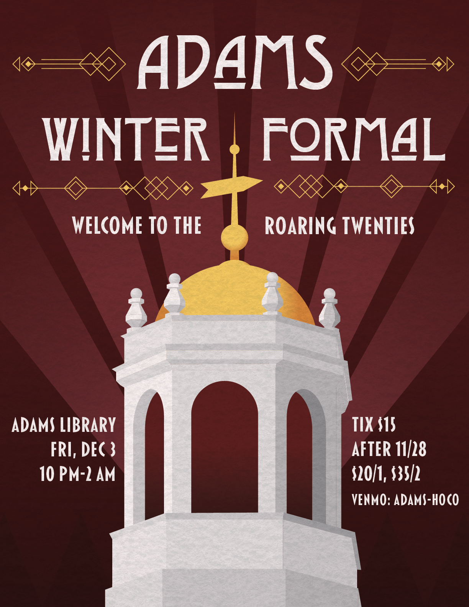
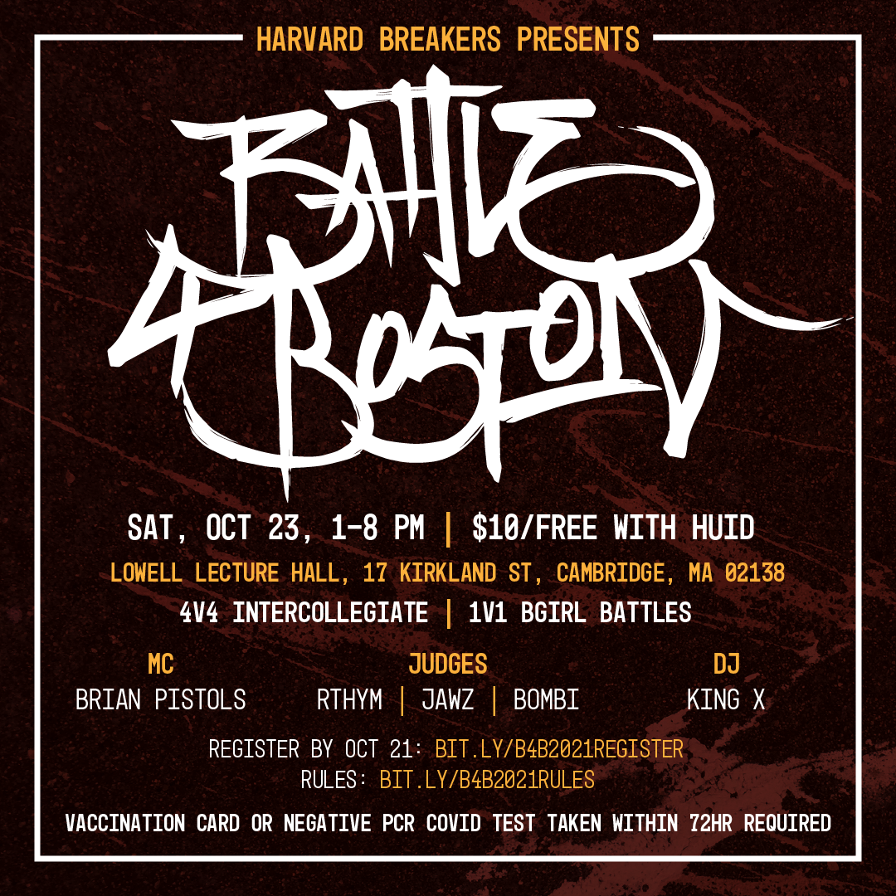
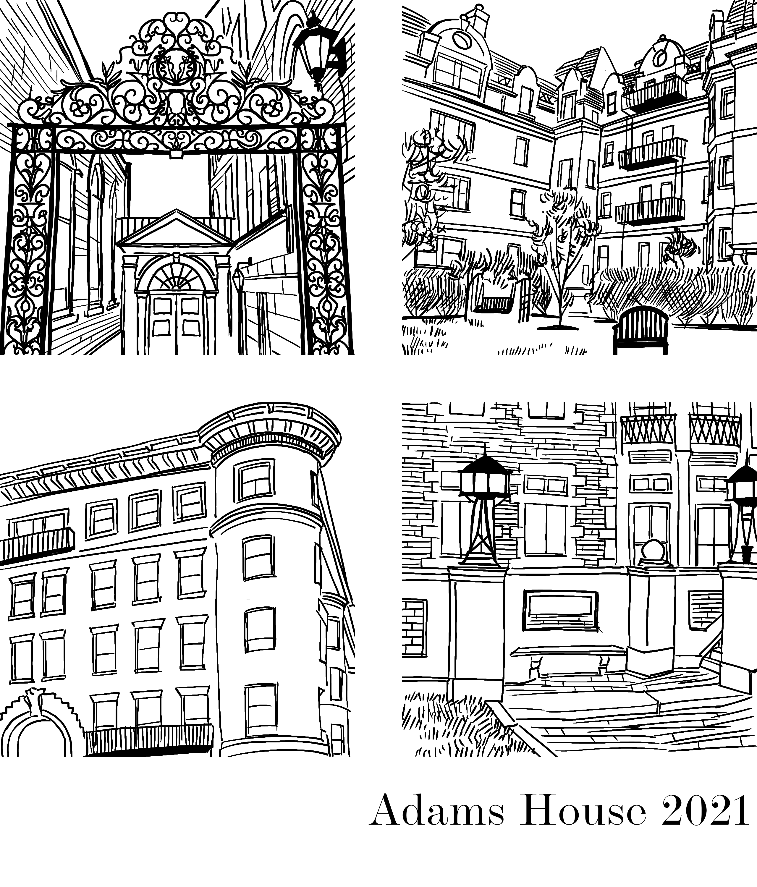
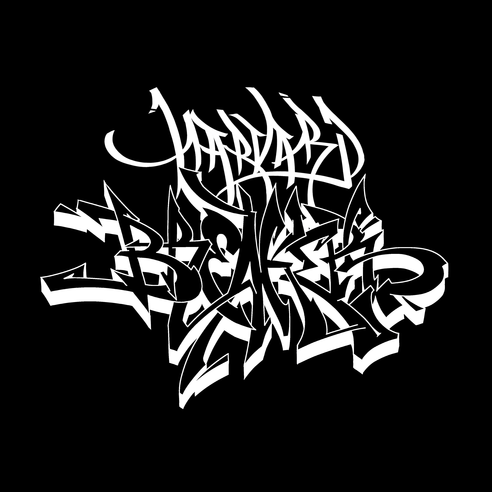
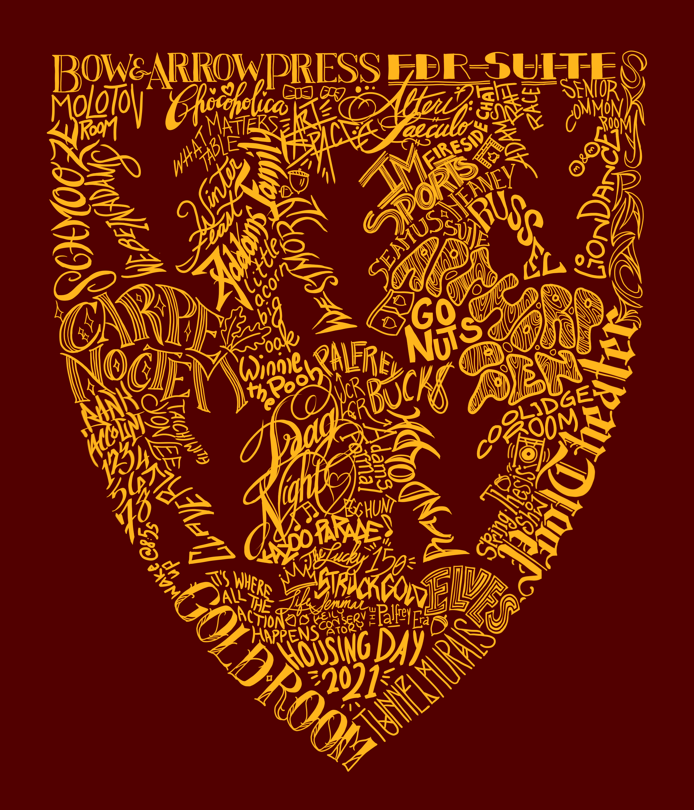
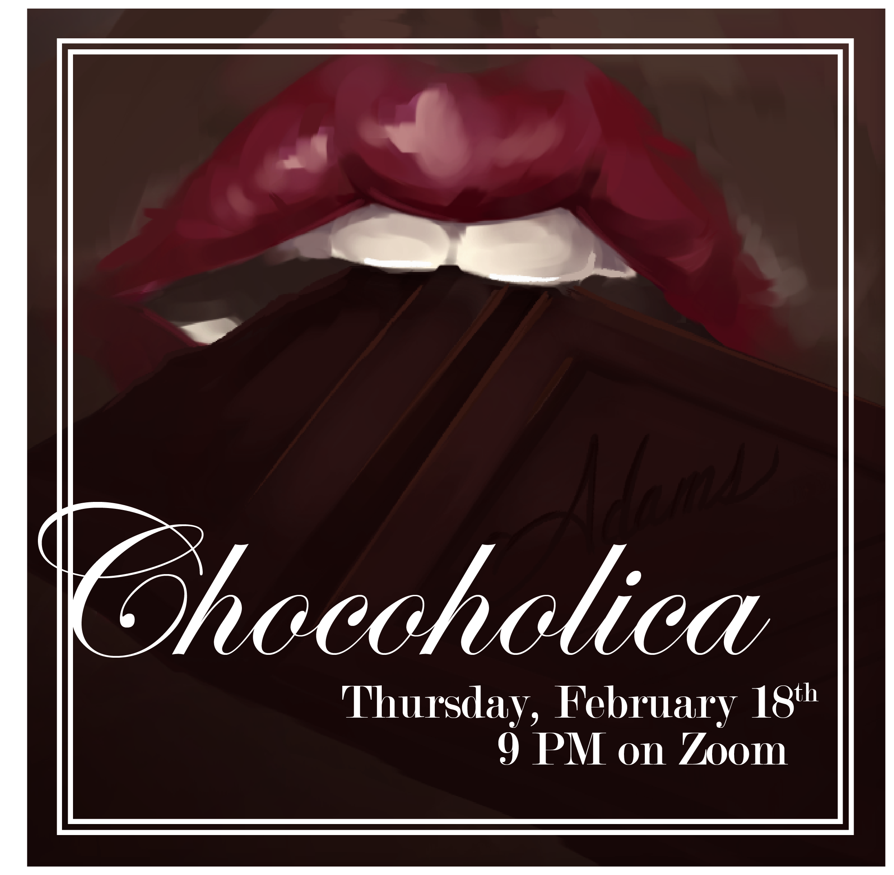
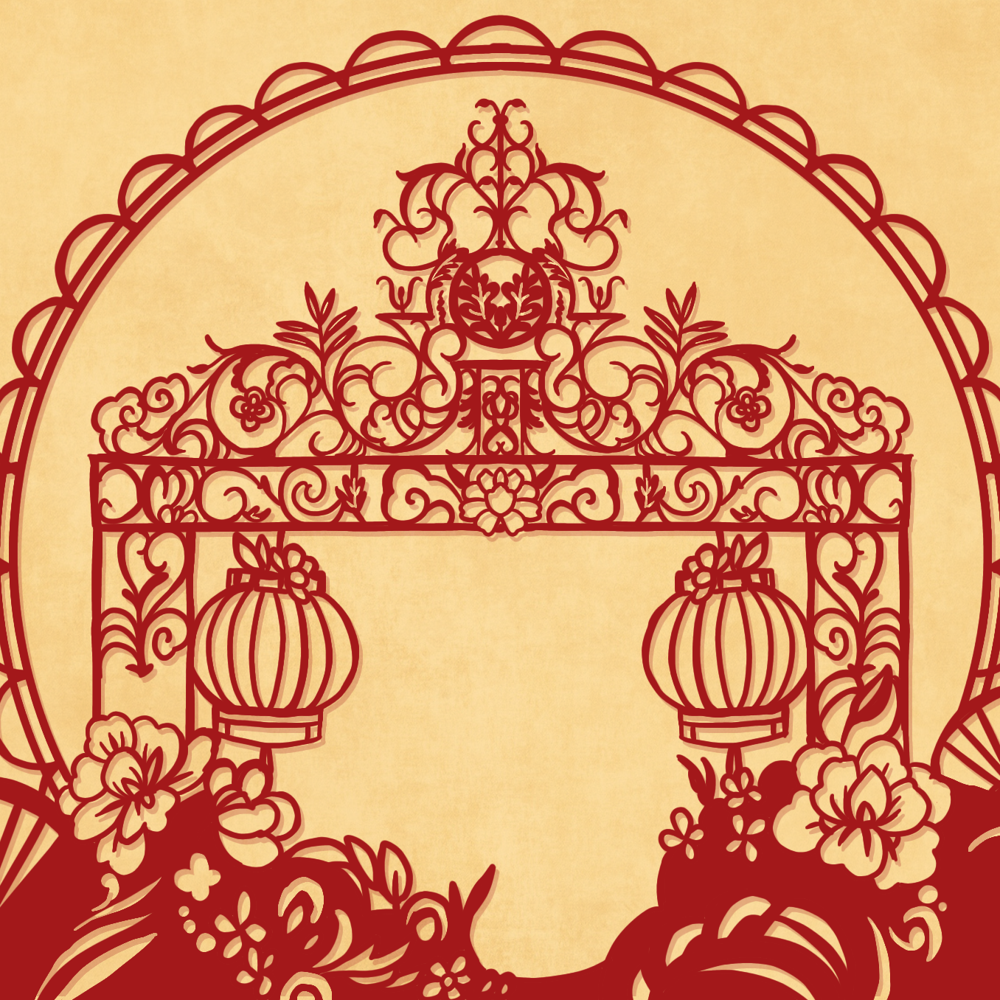
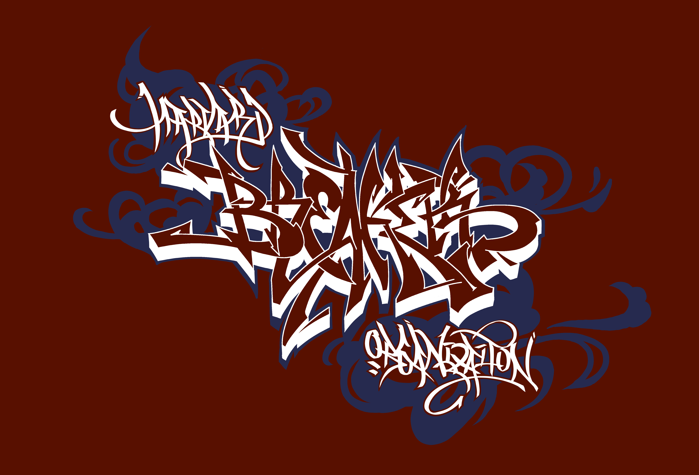
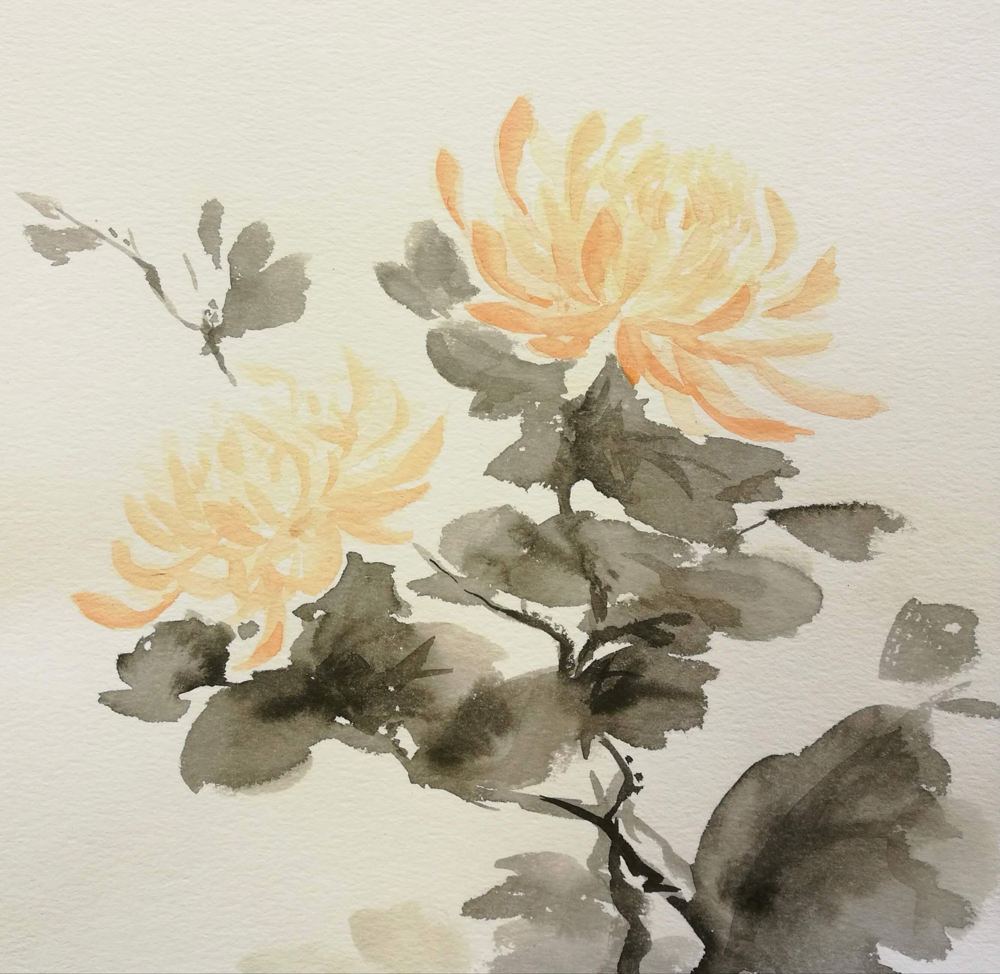
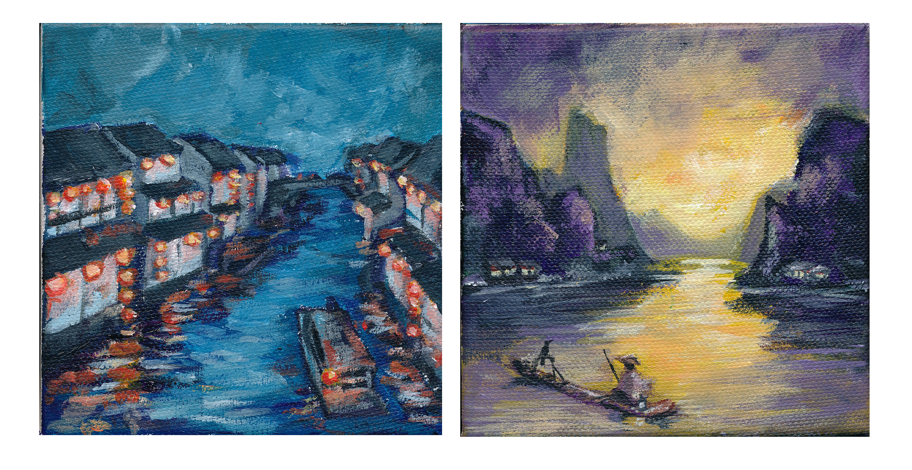

# Art
GitHub pages is not designed for nice gallery display, so this page is not going to be a UI/UX masterpiece. Graphic design work will also be included. Within each year, pieces are roughly reverse chronological

My public art Instagram is [here](https://instagram.com/xin_wen_xin). 

## 2022

## 2021
Adams Winter Formal flyer. One of the few vector illustrations I've completed. Inspired by Art Deco style in order to fit the theme of "The Great Gatsby". Putting aside my opinion on whether the theme was in good taste, the poster turned out well.

Battle for Boston flyer. The logo for Battle for Boston is done with handstyle. The background is a heavily modified paint texture and concrete texture. 

Adams Orientation shirt. Adams has five main houses - Apthorp, Russell, Randolph, Westmorly, and Claverly - but only the student residences are included here.

 

Harvard Breakers logo. Adapted from the 2020 hoodie. This design is closer to my original hoodie design; the word "Organization" was a last minute addition to the hoodie to align with Harvard merchandise guidelines.

Adams Housing Day shirt. Inspired by the Adams tunnels, which will unfortunately be destroyed in renovations. From a distance, the design blurs into the Adams House flag. Getting the imagery dense enough for this to be obvious was a challenge. 

Adams Chocoholica pub. Adams House provides "erotic chocolates" for this social, so a softer design compared to my usual clean graphics was used. 

Adams Lunar New Year Zoom background. I created variations on this design, but this color combination shows the most detail. 

## 2020
Harvard Breakers hoodie design. Breaking is a broader part of hip hop culture, which also includes writing (graffiti), DJing, and rapping. Rather than a clean graphic, this design incorporates some elements of handstyle and wildstyle pieces. Looking back, the design is toy (beginner, poser). 

## 2019
Room. 

## ≤ 2018
Hangzhou. 2018.

Chrysanthemum. 2018.

Waterfront. 2017.
